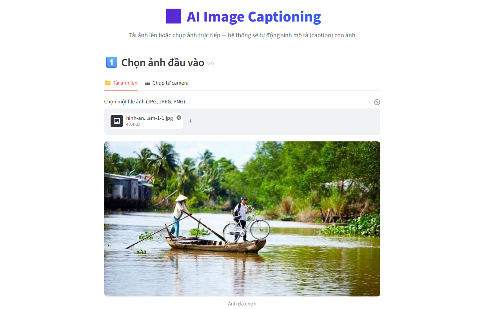
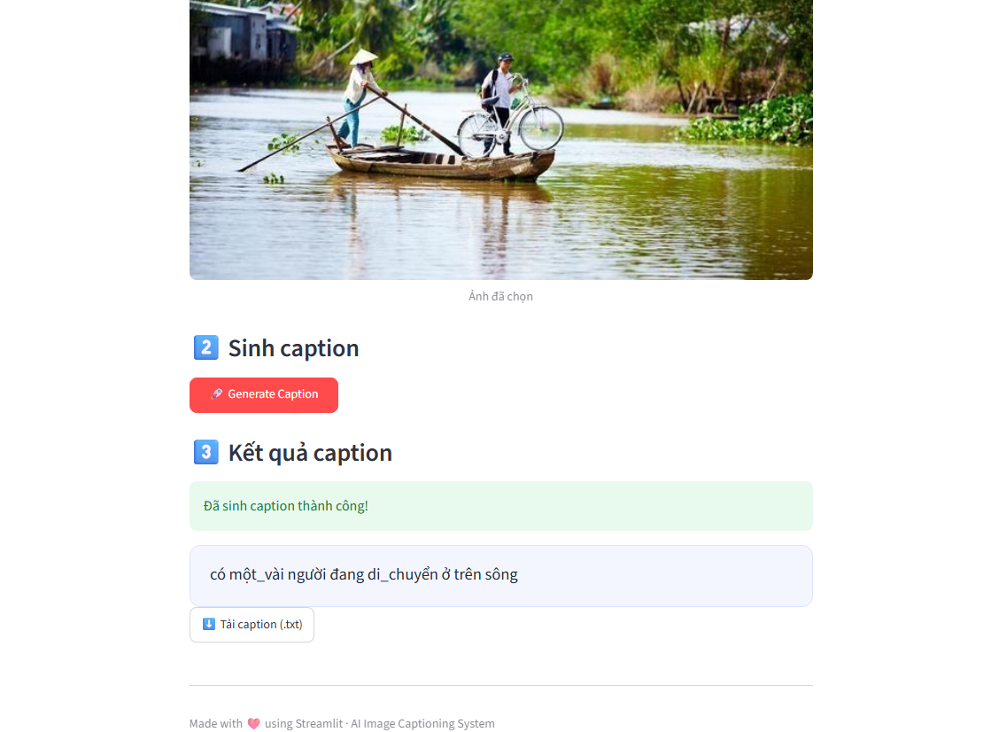

# VietNamese_Image_Captioning_with_CNN_LTSM 🖼️ 
> VietNamese Image Captioning with CNN LTSM: hệ thống đơn giản dùng để sinh ghi chú, mô tả tự động cho bức ảnh sử dụng kiến trúc Encoder-Decoder: **ResNet18 pretrained** làm Encoder trích xuất đặc trưng của ảnh và **LSTM  4 layers** làm decoder sinh mô tả cho ảnh


---
## Introduce
***VietNamese Image Captioning with CNN LTSM***: là một dự án học sâu đơn giản kết hợp hai mô hình trong lĩnh vực thị giác máy tính (computer vision) và sử lý ngôn ngữ tự nhiên (NLP) có khả năng **tự động sinh mô tả cho ảnh**

Mô hình sử dụng kiến trúc **Encoder-Decoder**
- **Encoder**: ResNet18 (pretrained trên bộ DL ImageNet) dùng để trích xuất đặc trưng của ảnh.
- **Decoder**: sử dụng mạng LSTM 4 lớp sinh mô tả theo từng từ theo chiến lược recursive forecasting, có sử dụng lớp Embedding layer được xây dựng từ bộ DL KTVIC.

## Demo system
| Image input | caption is generated |
|---|---|
|  |  |

## Pipline system

**1. Training pipeline**
```
                 ┌────────────────────────┐                ┌────────────────────────┐
Ảnh đầu vào      |                        |  Feature Maps  |                        |
───────────────► |  ResNet18 (pretrained) |──────────────► |  Linear + Tanh function|
(3,224,224)      |  (remove last FC layer)|     |          |  (hidden state)        | 
                 └────────────────────────┘     |          └────────────────────────┘
                                                | concatnate            │ (h0,c0)
                                                |                       │
                                                |                       |
                                                |                       |
                                                |                       |                                                                                       w1 w2 w3... <end>
                                                |                       |                                                                                                 |
Caption thật                                    |                       |                                                                                                 | 
<start> w1 w2 w3 ... <end>                      |                       |                                                                                                 |                                           
                          ┌────────────────┐    ▼                       ▼                                                                                                 ▼
Input                     |                | Embedding vector ┌────────────────────────┐  Output         ┌────────────────────────┐predict word probabilities ┌────────────────────────┐ 
─────────────────────────►|Embedding layer |────────────────► |  LTSM (4 layer)        |────────────────►|   Fully Connected      |──────────────────────────►|    Cross Entropy Loss  |───────────► Backward
<start>w1 w2 w3 ...       |                |                  | teacher forcing        |                 | + SoftMax(vocab_size)  |                           |                        |
                          └────────────────┘                  └────────────────────────┘                 └────────────────────────┘                           └────────────────────────┘

```

**2. Inference pipeline**
```
                 ┌────────────────────────┐                ┌────────────────────────┐
Ảnh đầu vào      |                        |  Feature Maps  |                        |
───────────────► |  ResNet18 (pretrained) |──────────────► |  Linear + Tanh function|
(3,224,224)      |  (remove last FC layer)|     |          |  (hidden state)        | 
                 └────────────────────────┘     |          └────────────────────────┘
                                                | concatnate            │ (h0,c0)
                                                |                       │
                                                |                       |
                                                |                       |
                                                |                       |                                                                                      
                                                |                       |                                                                                      
                                                |                       |                                                                                                
                                                |                       |                                                                                                                                           
                          ┌────────────────┐    ▼                       ▼                                                                                                
Input                     |                | Embedding vector ┌────────────────────────┐  Output,(hn, cn)┌────────────────────────┐    predict word  
─────────────────────────►|Embedding layer |────────────────► |  LTSM (4 layer)        |────────────────►|   Fully Connected      |──────────────────────────►  a word
<start>                   |                |                  | teacher forcing        |         |       | + SoftMax(vocab_size)  |                                |      
 ▲                        └────────────────┘                  └─────────────── ▲───────┘         |       └────────────────────────┘                                |
 |                                                                             |                 |(hn, cn)                                                         |
 |                                                                             ──────────────────┘                                                                 |
 |                                                                                                                                                                 |
  ─────────────────────────────────────────────────────────────────────────────────────────────────────────────────────────────────────────────────────────────────┘
```
## Cấu trúc thư mục🗂️
```
VietNamese_Image_Captioning_with_CNN_LTSM/
├── ImageResult/ # Ảnh demo chương trình
├── base_model/
│        ├──── MLP.py #Kiến trúc mạng NN  cơ bản
|        └──── ResNet_model.py # Model ResNet tự thiết kế
├── configuration/ # Thư mục lưu trữ các cấu hình cần thiết
|        ├──── mean_std_img.json # file lưu trữ thông số mean và std để normalize cho ảnh
|        └──── vocab.json # Lưu các thông số thiết lập cho vocab
├── model/
|        └──── build_model.py # file xây dựng mô hình cho toàn bộ bài toán
├── model_inference/
|        └──── app.py # file xây dựng giao diện và chạy chương trình
├── notebooks/
|        ├──── Compute_mean_std_image.ipynb # file notebooks để tính mean std của ảnh trên bộ DL
|        ├──── Train_Model.ipynb # file huấn luyện mô hình
|        └──── download_data_build_Vocab.ipynb # file thực hiện xây dựng vocabulary trên bộ DL
├── source/
|        ├──── preprocessing/
|        |                ├──── preprocessing_img.py # file xử lý ảnh đầu vào của mô hình và source tính toán mean std image            
|        |                └──── preprocessing_text.py # file source xử lý text đầu vào            
|        ├──── vocabulary/
|        |                └──── vocab.py # Định nghĩa và xây dựng vocab
|        └──── organize_data.py # file định nghĩa tổ chức DL theo kiểu dữ liệu DataSet trong pytorch
├── README.md
└──── requirement.txt
```  
## Setting⚙️
### Yêu cầu hệ thống máy tính
- Python >=3.11
- CUDA (Khuyến nghị dùng để huấn luyện mô hình nhanh hơn - có thể chạy CPU nhưng chậm)
### Các bước cài đặt
1. Clone Repository
```bash
>>> git clone https://github.com/ChienDoanDuy204/VietNamese_Image_Captioning_with_CNN_LTSM.git
>>> cd VietNamese_Image_Captioning_with_CNN_LTSM
```
2. Create virtual evironment
```bash
>>> conda create -n <env_name>
>>> conda activate <env_name>
```
3. install library and packages
```bash
>>> pip install -r requirements.txt
```
4. dowload model_weight.pth
```bash
>>> wget https://huggingface.co/doanduychien204/Generate_caption_from_Image/resolve/main/model_weight.pth
```

## Sử Dụng 💻
```bash
>>> cd model_inference
>>> streamlit run app.py
```

## Các tham số huấn luyện model
```
embedding_dim = 1024
hidden_dim = 1024
num_layer_LSTM = 4
vocab_size = 2000
max_length = 30
lr_encoder = 1e-05
lr_decoder = 1e-03
weight_decay = 0.0001
```
